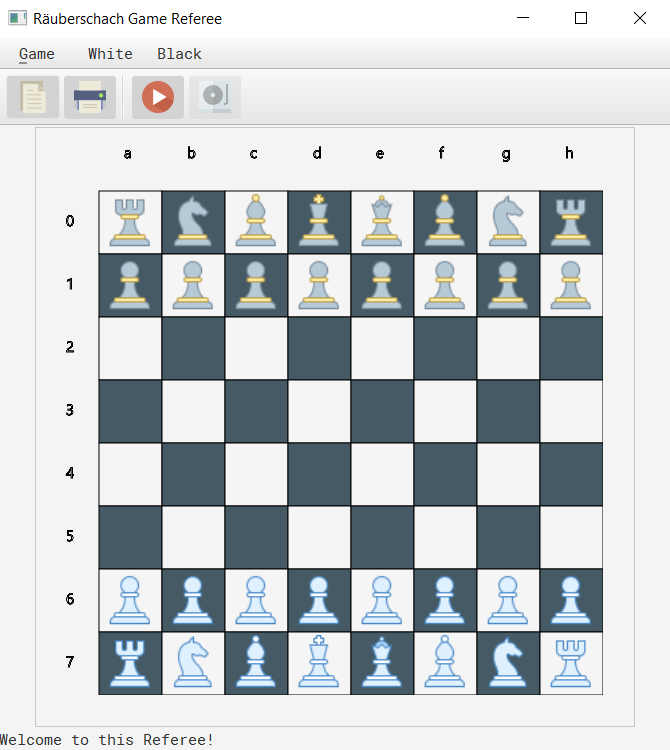

# raeuberschach-game-referee

A Java GUI for playing various chess versions, and more importantly, programming your own AIs to play against humans or other AIs.

Rules: https://en.wikipedia.org/wiki/Losing_chess

To gain an Overview, download the .jar listed under the releases and start a game by pressing the red play button.
You have to play both sides if you did not load a Player .jar into the game.

Watch out, this is kind of different to usual chess!
